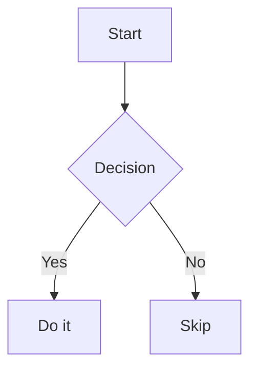

# @luytbq/md-to-docx

Convert Markdown to DOCX (Word) with YAML frontmatter config, mermaid diagrams, tables, and images.

## Features

- Headings (H1–H6), paragraphs, bold, italic, inline code, links
- Tables with column alignment and alternating row colors
- Fenced code blocks with language label
- Mermaid diagrams rendered as PNG images
- Local images (PNG, JPEG, etc.) with optional size override
- Bullet and numbered lists (nested)
- Page breaks, horizontal rules
- Full style control via YAML frontmatter (font, size, color, spacing, ...)
- Programmatic API + CLI

## Requirements

- Node.js >= 18
- [`mmdc`](https://github.com/mermaid-js/mermaid-cli) for mermaid diagrams: `npm install -g @mermaid-js/mermaid-cli`

## Installation

```bash
npm install -g @luytbq/md-to-docx
```

## CLI

```bash
md-to-docx input.md
md-to-docx input.md -o output.docx
md-to-docx input.md -o output.docx --keep-mermaid-text
```

| Flag | Description |
|:-----|:------------|
| `-o`, `--output` | Output `.docx` path. Default: same directory as input, same filename |
| `--keep-mermaid-text` | Append mermaid source code after each rendered diagram |

## Programmatic API

```js
import { convert, convertFile } from '@luytbq/md-to-docx';

// From a markdown string → Buffer
const { buffer, warnings } = await convert(markdownString, {
  baseDir: '/path/to/assets',   // for resolving relative image paths
  keepMermaidText: false,
  config: { /* config overrides — see Config section */ },
});

// From a file → writes .docx file
const { outputPath, warnings } = await convertFile('report.md', {
  output: 'report.docx',        // optional, defaults to same dir
  keepMermaidText: false,
});

// warnings: [{ type: 'mermaid' | 'image', message: string }]
for (const w of warnings) console.warn(`[${w.type}] ${w.message}`);
```

## Config via YAML Frontmatter

Add a `---` block at the top of your markdown file to control document style:

```markdown
---
title: My Report

page:
  size: A4         # A4 | Letter
  margin: 2        # cm, applies to all sides

body:
  font: Arial
  size: 11
  color: 1F272E
  spacing_after: 6

heading:
  font: Arial
  h1:
    size: 20
    bold: true
    color: 1F272E
    before: 20     # spacing before (pt)
    after: 8       # spacing after (pt)
    align: null    # null | center | right
  h2:
    size: 16
  # h3–h6 follow the same structure

table:
  header:
    fill: 2D4E6E
    color: FFFFFF
    bold: true
    size: 10
  row:
    odd_fill: F0F4F8
    even_fill: FFFFFF
    color: 1F272E
    size: 10
  border: C0C8D0
  border_size: 4
  cell_padding: 0.15  # cm

code:
  font: Courier New
  size: 9
  color: 333333
  fill: F3F4F5
  indent: 0.63        # cm
  label:
    show: true
    fill: E8E8E8
    color: 666666
    size: 8

inline_code:
  font: Courier New
  color: 555555

list:
  indent: 0.63        # cm
  bullets:
    - •
    - ◦
    - ▪

link:
  color: 0563C1

output:
  filename: my-report   # output filename without extension
---

# Document starts here
```

## Mermaid Diagrams

````markdown

````

If `mmdc` is not found, the diagram falls back to a plain code block and a warning is emitted.

**Environment variables:**

| Variable | Description |
|:---------|:------------|
| `MMDC_PATH` | Path to `mmdc` binary |
| `CHROME_PATH` | Path to Chrome/Chromium used by mermaid renderer |

## Images

```markdown


{width=600 height=400}
```

Images are resolved relative to the markdown file location (CLI) or `baseDir` option (API).

## Page Breaks

```markdown
<div style="page-break-after: always"></div>
```

Or inline:

```
page-break-after: always
```

## License

MIT
