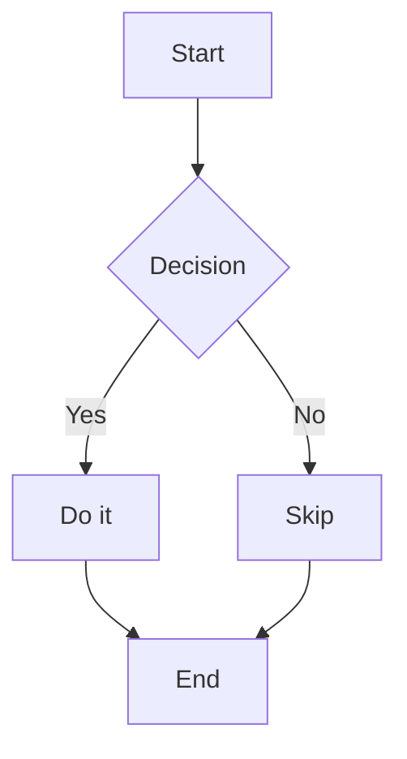
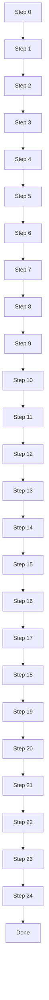
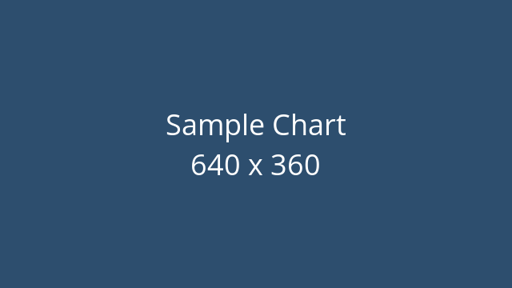

# Introduction

This document exercises **every** feature of `md-to-docx`: headings, inline
formatting, tables, code blocks, mermaid diagrams, images with captions, nested
and numbered lists, internal links, page breaks, and horizontal rules.

Quick navigation:

- Go to [Tables](#tables)
- Go to [Mermaid Diagrams](#mermaid-diagrams)
- Go to [A Tall Diagram](#a-tall-diagram)
- Go to [Images](#images)
- Go to [Lists](#lists)
- Go to [Notes](#notes) and the second [Notes](#notes-1)

## Inline Formatting

A paragraph with **bold**, _italic_, `inline code`, an [external link](https://example.com),
and an [internal link back to Introduction](#introduction).

Markers can mix: **bold with `code` inside**, and _italic spanning words_.

---

## Tables

| Feature        | Status      | Notes                         |
|:---------------|:-----------:|------------------------------:|
| Headings       | Done        | H1–H6                         |
| Internal links | Done        | `[text](#slug)`               |
| Mermaid        | Done        | font-normalized               |
| Tall slicing   | Optional    | needs ImageMagick             |

A cell with a `pipe \| escaped` and an [internal link](#tables) inside it.

## Code Block

```js
function greet(name) {
  return `Hello, ${name}!`;
}
console.log(greet('World'));
```

A fenced block with no language label:

```
plain preformatted text
  preserves    spacing
```

<div style="page-break-after: always"></div>

## Mermaid Diagrams

A normal-sized flowchart (rendered as an image, text normalized to ~9.5pt):



### A Tall Diagram

A long vertical chain — taller than one page. Run with `--split-tall-mermaid`
(and ImageMagick installed) to slice it across pages; otherwise it is shrunk to fit.



## Images

An image with a caption (the alt text appears in italics below it):



The same image, width-constrained to 300px:


## Lists

Nested bullets (2- and 4-space schemes both work):

- Top level item
  - Nested level one
    - Nested level two
- Back to top level
  this wrapped line is lazily joined onto the item above

Numbered list:

1. First step
2. Second step
3. Third step

A paragraph here breaks the list, so the next list restarts numbering at 1.

1. Fresh first
2. Fresh second

## Notes

This is the first "Notes" section — its slug is `#notes`.

## Notes

This is the second "Notes" section — duplicate heading, so its slug is `#notes-1`.

---

End of the kitchen-sink document.
