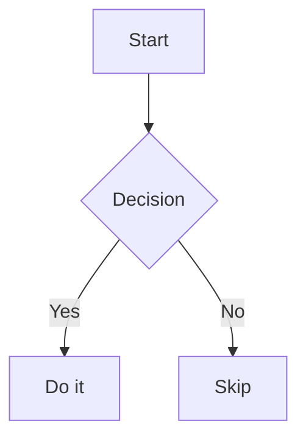

<!-- @config
title: Sample Document
body:
  font: Arial
  size: 11
-->

# Heading 1

This is a **bold** paragraph with _italic_ text and `inline code`.

Jump to the [Lists](#lists) section, or see [Code Block](#code-block).

## Heading 2

A [link to Google](https://www.google.com) inline.

### Heading 3

| Name       | Role       | Status  |
|:-----------|:----------:|--------:|
| Alice      | Developer  | Active  |
| Bob        | Designer   | Active  |
| Carol      | Manager    | Pending |

## Code Block

```js
function greet(name) {
  return `Hello, ${name}!`;
}
console.log(greet('World'));
```

## Lists

- Item one
- Item two
  - Nested item
  - Another nested
- Item three
  this text continues item three on a wrapped line

1. First step
2. Second step
3. Third step

A paragraph here breaks the list, so the next one restarts at 1.

1. Fresh first
2. Fresh second

## Diagram



## Horizontal Rule

---

End of document.
